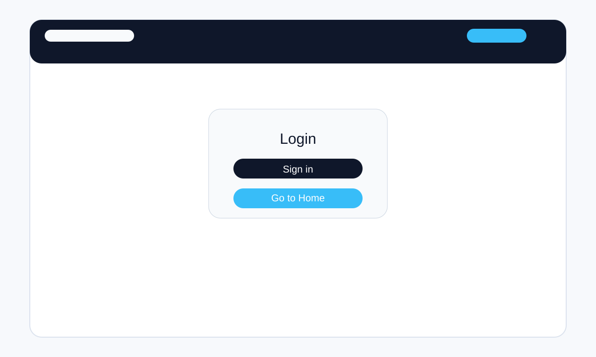
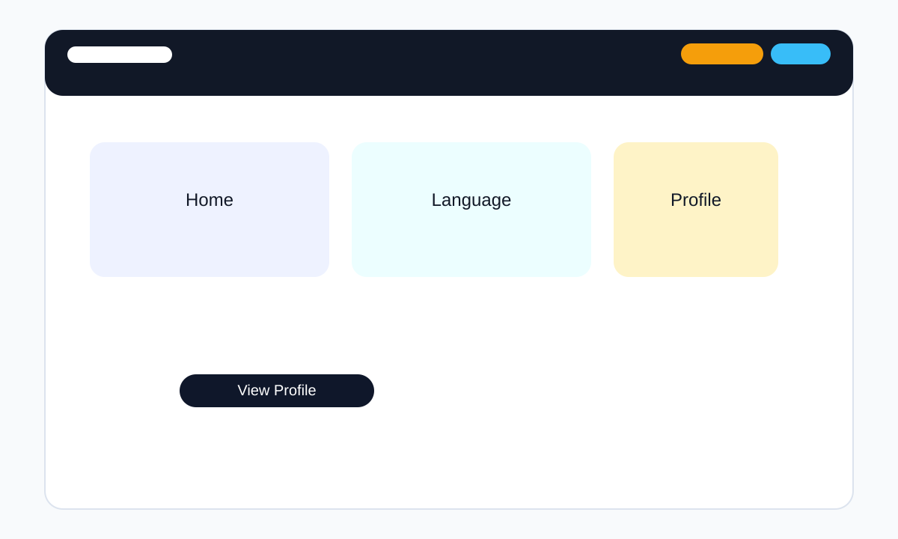
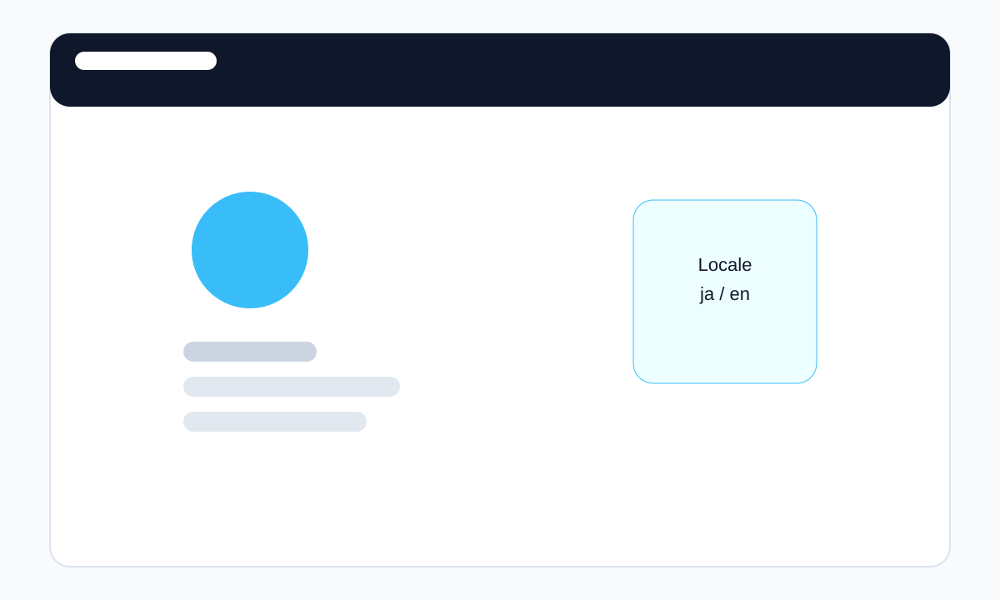

# React × AWS CDK で作る多言語サンプルアプリを App Runner にデプロイしてみた

## 1. はじめに

最近、Web アプリ開発では「多言語対応」が当たり前のように求められるようになりました。
ただ、実装方法はプロジェクトごとに違い、どの設計にするかで運用のしやすさがかなり変わります。

今回は、React で作った多言語サンプルアプリを AWS CDK で App Runner にデプロイする手順をまとめました。

本記事では、以下の要件を実現しています。

- React で動作する多言語対応アプリ
- `ja` / `us` を切り替え可能
- ログイン前は画面上の `ja` / `us` ボタンで切り替え
- ログイン後はユーザー設定から言語を読み込み
- ログインはモック。JSON ファイルでユーザー設定を管理
- AWS CDK で App Runner を構築

## 2. 今回の要件

まずは、今回の実装で何を目指したのかを整理します。

> ここでは、実際の画面イメージを入れると理解がさらに深まります。例えば、ログイン画面・ホーム画面・プロフィール画面のスクリーンショットを並べると、構成のイメージが伝わりやすくなります。

### 要件のポイント

- ログイン画面、ホーム画面、プロフィール画面の 3 画面を実装
- ログイン前は URL やボタンで言語切り替え
- ログイン後はサーバー側のユーザー設定に従う
- 設定変更は JSON ファイル書き込みで管理

### 使った技術

- React 18
- Vite + TypeScript
- react-i18next
- Express（モック API）
- Docker
- AWS CDK v2
- App Runner

## 3. プロジェクト構成

```
multi-lang-sample/
  ├ src/
  ├ server/
  ├ Dockerfile
  ├ cdk/
  ├ docs/
  ├ package.json
  └ tsconfig.json
```

- `src/`: React アプリ本体
- `server/`: モック API サーバー
- `Dockerfile`: コンテナ化定義
- `cdk/`: AWS CDK で App Runner を構築
- `docs/`: 本記事や手順の整理

## 4. ローカル開発の流れ

まずはローカルでどのような画面が表示されるのかを確認します。以下のような流れで開発を進めました。



※ 実際の UI と同じようなイメージを示すことで、読者が「どんな画面なのか」をすぐ把握しやすくなります。

### セットアップ

```bash
cd c:\Develop\nodejs\multi-lang-sample
npm install
```

### ローカルで動かす

```bash
npm run dev
```

フロントエンドは `http://localhost:5173`、バックエンドは `http://localhost:4000` です。

## 5. Docker イメージの作成

### Dockerfile のポイント

- `builder` ステージで React アプリをビルド
- `runtime` ステージで `node server/index.js` を実行

App Runner では、サーバーとクライアントを同じコンテナ内に入れて動かす構成にしています。

### ビルド

```bash
docker build -t multi-lang-sample-app:latest .
```

## 6. ECR への push

### ECR へログイン

```bash
aws ecr get-login-password --region ap-northeast-1 | docker login --username AWS --password-stdin <AWS_ACCOUNT_ID>.dkr.ecr.ap-northeast-1.amazonaws.com
```

### タグ付け

```bash
docker tag multi-lang-sample-app:latest <AWS_ACCOUNT_ID>.dkr.ecr.ap-northeast-1.amazonaws.com/multi-lang-sample-app:latest
```

### Push

```bash
docker push <AWS_ACCOUNT_ID>.dkr.ecr.ap-northeast-1.amazonaws.com/multi-lang-sample-app:latest
```

## 7. AWS CDK で App Runner デプロイ

構築後の画面イメージを見せると、単なる構成説明ではなく「実際に動くアプリ」として伝わりやすくなります。



※ ログイン後の状態をイメージできるようにしておくと、言語切り替えやプロフィール遷移の流れが伝わりやすくなります。

### CDK の準備

```bash
cd cdk
npm install
npx tsc
```

### デプロイ

```bash
npx cdk deploy --require-approval never
```

この手順で、App Runner サービスと必要な IAM ロールが作成されます。

## 8. 更新手順

アプリを変更したら、次の流れで更新します。

```bash
npm run build

docker build -t multi-lang-sample-app:latest .

docker tag multi-lang-sample-app:latest <AWS_ACCOUNT_ID>.dkr.ecr.ap-northeast-1.amazonaws.com/multi-lang-sample-app:latest

docker push <AWS_ACCOUNT_ID>.dkr.ecr.ap-northeast-1.amazonaws.com/multi-lang-sample-app:latest
```

App Runner は `latest` タグの更新を検知して自動デプロイします。

## 8. 画面イメージを添えると伝わりやすいポイント

実際のスクリーンショットや図を入れると、技術記事の説得力が上がります。

特に以下のような要素は、画像があるとかなり伝わりやすいです。

- ログイン画面での初期状態
- 言語切り替えの UI
- ホーム画面からプロフィール画面へ遷移する流れ

今回は、簡易的な SVG 画像を用意して、記事内でイメージを見せられるようにしています。



---

## 9. まとめ

最後に、今回の実装をもう一度整理すると、次のようなポイントが自然に伝わります。

- React で多言語対応を実装しやすい構成にした
- App Runner へデプロイできるように Docker と AWS CDK を組み合わせた
- 画面ごとの遷移をわかりやすく示せるようにした

実際のスクリーンショットを入れることで、コードの説明だけでは伝わりにくい「ユーザー体験」を補足しやすくなります。

今回の構成では、React の多言語 UX を保ちながら、AWS CDK で App Runner にデプロイできる形を整えました。

- ログイン前とログイン後の言語切り替えを分離
- JSON ベースの設定保存でインフラを簡略化
- ECR + App Runner で継続的にデプロイ可能な構成

個人的には、サンプルアプリとしては「多言語」「認証」「デプロイ」を一通り触れられる構成がとても良いと思いました。

次は、認証や設定管理をもう少し本格的にしたり、翻訳管理を別の方法に切り替えたりするのが楽しそうです。
