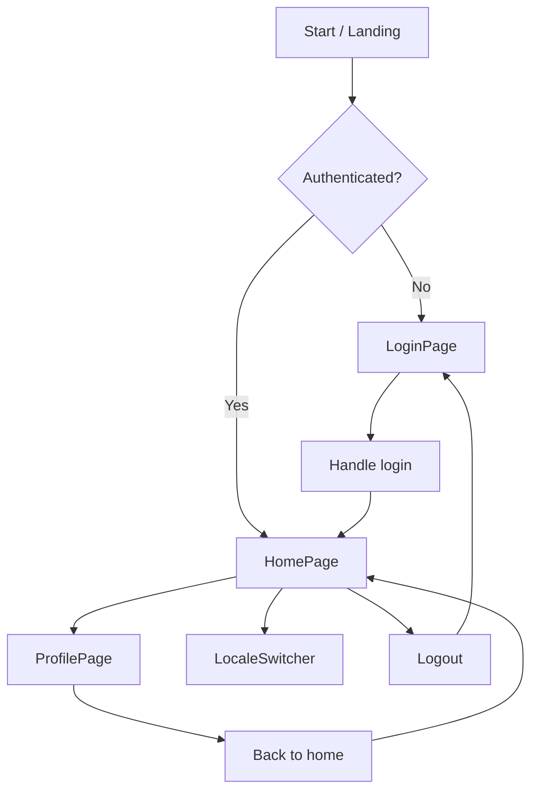
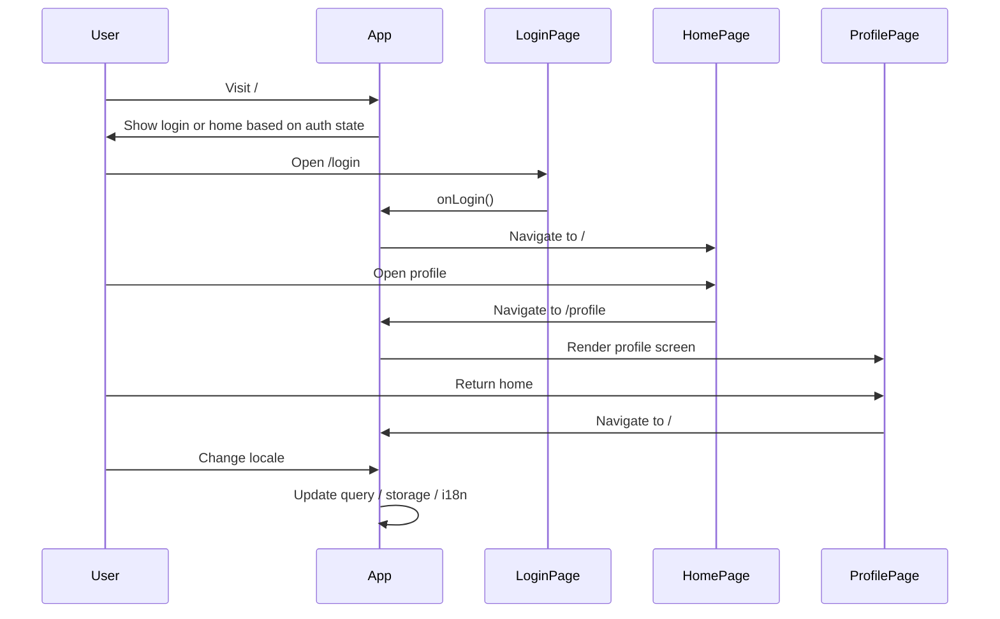

# 画面構成と遷移

## 画面構成図

```mermaid
flowchart TD
    A[Start / Landing] --> B{Authenticated?}
    B -- No --> C[LoginPage]
    B -- Yes --> D[HomePage]
    C --> E[Handle login]
    E --> D
    D --> F[ProfilePage]
    D --> G[LocaleSwitcher]
    F --> H[Back to home]
    H --> D
    D --> I[Logout]
    I --> C
```

## 画面遷移の概要

```mermaid
sequenceDiagram
    participant User
    participant App
    participant LoginPage
    participant HomePage
    participant ProfilePage

    User->>App: Visit /
    App->>User: Show login or home based on auth state

    User->>LoginPage: Open /login
    LoginPage->>App: onLogin()
    App->>HomePage: Navigate to /

    User->>HomePage: Open profile
    HomePage->>App: Navigate to /profile
    App->>ProfilePage: Render profile screen

    User->>ProfilePage: Return home
    ProfilePage->>App: Navigate to /

    User->>App: Change locale
    App->>App: Update query / storage / i18n
```

## 主要な状態

- 認証状態: `isAuthenticated`
- ユーザー情報: `userId`
- 優先言語: `preferredLocale`
- 現在のルート: `/`, `/login`, `/profile`
